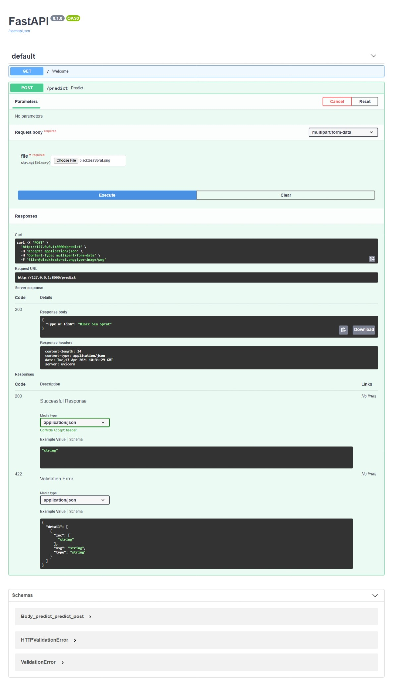

# Fish Identifier 

# Description

*** A Large-Scale Dataset for Segmentation and Classification ***

Authors: O. Ulucan, D. Karakaya, M. Turkan
Department of Electrical and Electronics Engineering, Izmir University of Economics, Izmir, Turkey
Corresponding author: M. Turkan
Contact Information: mehmet.turkan@ieu.edu.tr

Paper : A Large-Scale Dataset for Fish Segmentation and Classification
General Introduction

This dataset contains 9 different seafood types collected from a supermarket in Izmir, Turkey
for a university-industry collaboration project at Izmir University of Economics, and this work
was published in ASYU 2020.
The dataset includes gilt head bream, red sea bream, sea bass, red mullet, horse mackerel,
black sea sprat, striped red mullet, trout, shrimp image samples.

If you use this dataset in your work, please consider to cite:

@inproceedings{ulucan2020large,
title={A Large-Scale Dataset for Fish Segmentation and Classification},
author={Ulucan, Oguzhan and Karakaya, Diclehan and Turkan, Mehmet},
booktitle={2020 Innovations in Intelligent Systems and Applications Conference (ASYU)},
pages={1--5},
year={2020},
organization={IEEE}
}

## Description of the dataset

The dataset contains 9 different seafood types. For each class, there are 1000 augmented images and their pair-wise augmented ground truths.
Each class can be found in the "Fish_Dataset" file with their ground truth labels. All images for each class are ordered from "00000.png" to "01000.png".

For example, if you want to access the ground truth images of the shrimp in the dataset, the order should be followed is "Fish->Shrimp->Shrimp GT".


# To run the code on your local machine

```
python -m venv venv   # Create the environment

./venv/Scripts/activate # Activating the environment

pip install requirements.txt 

cd src 

uvicorn fish_classifier:app --reload

```




